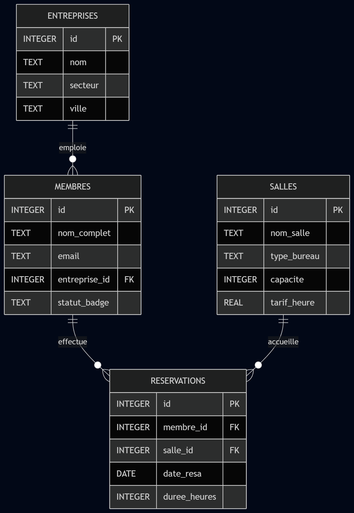

# Système de Gestion de Coworking
**Projet Final — Cours SQL**

**Présenté par :** Francesca TISNES
**Module :** M1 APE - DS2E
**Date :** Avril 2026

---

## 1. Le Contexte : Pourquoi ce projet ?

**Le Coworking : un écosystème dynamique**
- Des dizaines d'entreprises clientes (start-ups, freelances).
- Des centaines de membres avec des flux constants.
- Des salles louées à l'heure (Open Space, Bureaux, Réunions).

** Le problème (Gestion par Excel)**
- Redondance, erreurs de facturation, pertes de données.

** La solution (Base Relationnelle)**
- SQLite + Interface Web (Flask) pour une gestion fiable, automatisée et sécurisée.

---

## 2. Architecture & Conception (Le Schéma)

La base repose sur 4 tables normalisées (3NF) :

1. **entreprises** : Référentiel B2B.
2. **membres** : Les humains (liés par `entreprise_id`).
3. **salles** : Le catalogue (avec contrainte `CHECK` sur le type).
4. **reservations** : La table transactionnelle centrale.

---

## Diagramme Entité-Relation (ERD)

*Note : L'utilisation stricte des clés étrangères garantit l'intégrité de la base de données.*

---

## 3. Utilisation Quotidienne (Manipulation)

Comment le gérant utilise la base (`queries.sql`) :

- **INSERT** : Arrivée d'un nouveau client (Création de l'entreprise, puis ajout du membre via une sous-requête).
- **UPDATE** : Mesure de sécurité immédiate (ex: passer le `statut_badge` en 'Bloqué' en cas de perte).
- **DELETE** : Annulation d'une réservation erronée.

---

## 4. Analyse Financière (Reporting)

**Le Chiffre d'Affaires par Entreprise (`analysis.sql`)**
- Opération complexe nécessitant une **triple jointure** :
  *(Entreprises ➔ Membres ➔ Réservations ➔ Salles)*
- Utilisation de l'agrégation `SUM(tarif_heure * duree_heures)` et `GROUP BY`.

**Contrôle qualité**
- Requête utilisant `IS NULL` pour isoler les membres orphelins (qui ne seraient rattachés à aucune entreprise et donc non facturables).

---

## 5. Le "Plus" : L'Interface Web (Flask)

**Un produit fini et prêt à l'emploi**
Au lieu de taper du SQL dans un terminal, le gérant utilise un tableau de bord SaaS :

1.  **Création du client** (Entreprise)
2.  **Inscription du membre** (lié dynamiquement à l'entreprise)
3.  **Réservation de salle** sécurisée

*Avantage : Protection contre les injections SQL (requêtes paramétrées) et respect physique des contraintes relationnelles via les listes déroulantes.*

---

# Merci de votre attention !

 